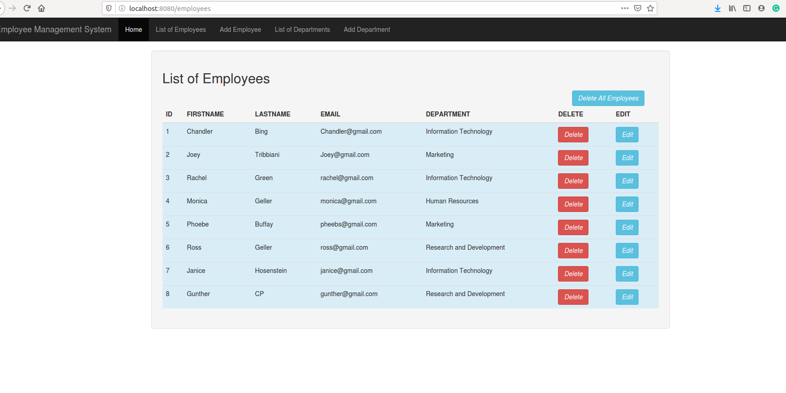
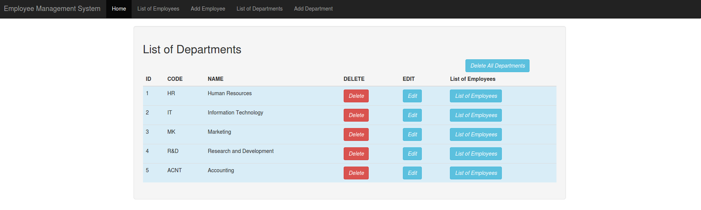
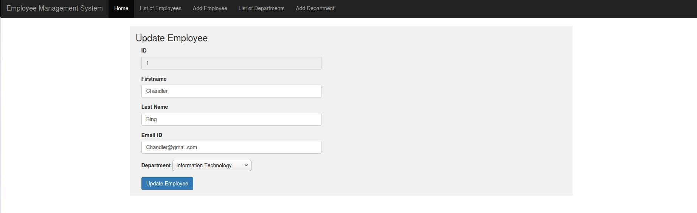
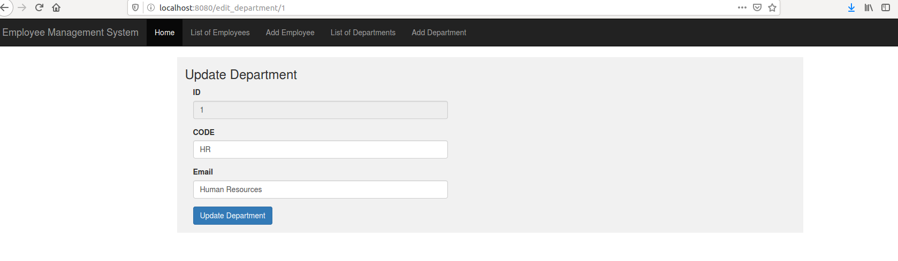
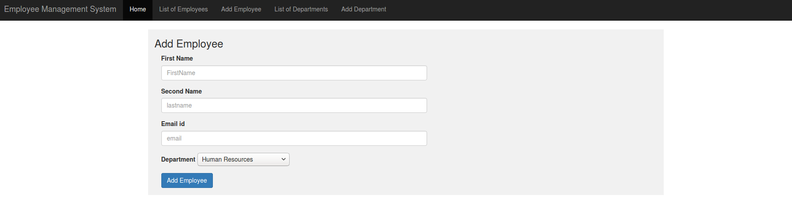
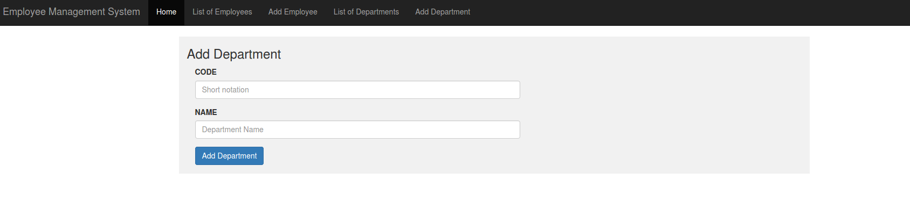

# Application
A SpringBoot Application 
<b>About Application:</b> 
● This application is the basic design of the employee management system.The entities used in this project are Employee and Department with a many to one relation between them. 
● Department(department_id,code_name,department_name) 
● Employee(employee_id,firstname,lastname,email,department_id) 
<b>Technologies Used:</b> 
● Maven Project 
● SpringBoot 
● Spring Data Jpa dependency 
● Thymeleaf dependency 
● Mysql database 
● Intellij IDE 
<b>Steps to run the application:</b> 
● Open mysql server and create a database with name ”EmpApp”. 
Command :CREATE DATABASE EmpApp; 
USE EmpApp; 
(Or)
Create a database with a name and write that in the place of “EmpApp” in the following line of code in ‘application.properties’ file.
spring.datasource.url​=​jdbc:mysql://localhost:3306/EmpApp 
● Place your mysql server username and password in the following lines of code in ‘application.properties’.
spring.datasource.username​=​root 
spring.datasource.password​=​password 
● Run ‘Application.java’ file 
● Application runs on ​http://localhost:8080/ 
<b> Some screenshots of the application</b>  

 

 

 

 

 

